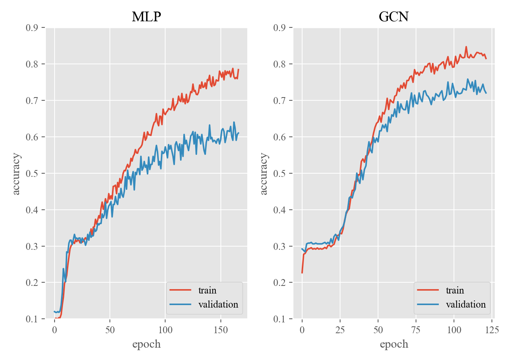

# GCN_Cora

## Results 
Cora classification results with
* Dropout: 0.5
* Number of GCN layers: 2
* Number of hidden features: 16
* Adam optimizer
* Learning rate: 1e-2
* L2 weight decay: 5e-4

| validation loss | validation accuracy |
| :---: | :---: |
|  |  |
